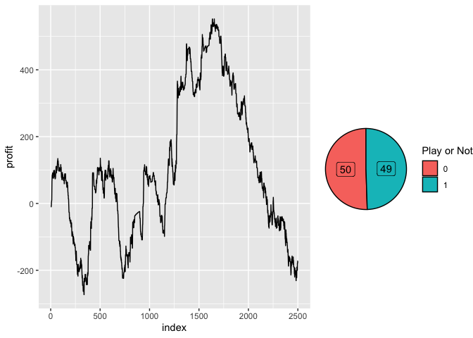

<!-- README.md is generated from README.Rmd. Please edit that file -->

# dsws

<!-- badges: start -->
<!-- badges: end -->

The goal of dsws is to be used as workshop material organized by
GoodJob! data science team.

## Installation

You can install the development version of dsws from
[GitHub](https://github.com/GoodJobTech/ds-ws) with:

``` r
# install.packages("devtools")
devtools::install_github("GoodJobTech/ds-ws")
```

## Example

Lets import workshop library.

``` r
library(dsws)
## basic example code
```

Lets check included data, starting with the odds file

``` r
summary(dsws::odds_table)
#>     user_id         level_id          line          OU           
#>  Min.   :101.0   Min.   :151.0   Min.   :1.5   Length:2500       
#>  1st Qu.:113.0   1st Qu.:163.0   1st Qu.:1.5   Class :character  
#>  Median :125.5   Median :175.5   Median :1.5   Mode  :character  
#>  Mean   :125.5   Mean   :175.5   Mean   :1.5                     
#>  3rd Qu.:138.0   3rd Qu.:188.0   3rd Qu.:1.5                     
#>  Max.   :150.0   Max.   :200.0   Max.   :1.5                     
#>       odd        
#>  Min.   : 1.003  
#>  1st Qu.: 1.379  
#>  Median : 1.836  
#>  Mean   : 2.328  
#>  3rd Qu.: 2.739  
#>  Max.   :19.653
```

Lets check test data scores

``` r
summary(dsws::scores)
#>     user_id         level_id     retrial_count    
#>  Min.   :101.0   Min.   :151.0   Min.   :  0.000  
#>  1st Qu.:113.0   1st Qu.:163.0   1st Qu.:  0.000  
#>  Median :125.5   Median :175.5   Median :  1.000  
#>  Mean   :125.5   Mean   :175.5   Mean   :  5.476  
#>  3rd Qu.:138.0   3rd Qu.:188.0   3rd Qu.:  6.000  
#>  Max.   :150.0   Max.   :200.0   Max.   :161.000
```

Lets check train data

``` r
summary(dsws::train_data)
#>     user_id         level_id     retrial_count     superundo_usage 
#>  Min.   :  1.0   Min.   :101.0   Min.   :  0.000   Min.   :0.0000  
#>  1st Qu.: 32.0   1st Qu.:121.0   1st Qu.:  0.000   1st Qu.:0.0000  
#>  Median : 63.0   Median :142.0   Median :  1.000   Median :0.0000  
#>  Mean   : 65.5   Mean   :145.5   Mean   :  3.823   Mean   :0.1453  
#>  3rd Qu.: 94.0   3rd Qu.:169.0   3rd Qu.:  4.000   3rd Qu.:0.0000  
#>  Max.   :150.0   Max.   :200.0   Max.   :177.000   Max.   :9.0000  
#>  shuffle_usage    
#>  Min.   : 0.0000  
#>  1st Qu.: 0.0000  
#>  Median : 0.2412  
#>  Mean   : 0.9382  
#>  3rd Qu.: 1.0000  
#>  Max.   :24.0000
```

Lets bet randomly

``` r
set.seed(4)
random_play_vector <- sample(c(0,1), replace=TRUE, size=nrow(odds_table))
score_the_play_vector(random_play_vector, scores = dsws::scores, odds_table = dsws::odds_table)
```



    #> TableGrob (1 x 2) "arrange": 2 grobs
    #>   z     cells    name           grob
    #> 1 1 (1-1,1-1) arrange gtable[layout]
    #> 2 2 (1-1,2-2) arrange gtable[layout]
